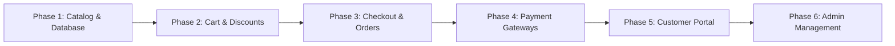

# Atelier E-Commerce: Master Phased Roadmap Plan

This master plan outlines the step-by-step development strategy to transform the Atelier frontend and Laravel backend into a complete, secure, and production-ready luxury e-commerce platform.

---

## 🗺️ Project Execution Phases

---

## 📦 Phase 1: Database Catalog & Product Architecture
> **Objective:** Replace static JSON mockup data with dynamic, database-driven catalog APIs and models.

### 1.1 Database Migrations & Models
- **`categories` Table**: `id`, `name`, `slug`, `image_url`, `description`, `parent_id`, `is_active`, `sort_order`.
- **`products` Table**: `id`, `category_id`, `name`, `slug`, `sku`, `price`, `compare_at_price`, `stock_quantity`, `is_featured`, `is_on_sale`, `is_active`, `description`, `highlights` (JSON), `specs` (JSON).
- **`product_images` Table**: `id`, `product_id`, `image_path`, `is_primary`, `sort_order`.
- **`product_variants` Table** *(Colors / Sizes)*: `id`, `product_id`, `color_name`, `color_hex`, `size`, `sku`, `additional_price`, `stock_quantity`, `image_url`.
- **`reviews` Table**: `id`, `user_id`, `product_id`, `rating`, `title`, `comment`, `is_verified_buyer`, `status` (pending/approved).

### 1.2 Controllers & Inertia Integration
- **`ShopController`**: Paginated products, live dynamic search, category filtering, multi-attribute filter (price range, ratings, in-stock).
- **`ProductController`**: Live product page (`/product/{slug}`), real stock check, related products by category, review listing & submission.
- **Database Seeders**: Seed real products with rich images, descriptions, specs, and reviews.

---

## 🛒 Phase 2: Cart, Wishlist & Dynamic Promo Engine
> **Objective:** Provide seamless shopping cart and wishlist management with guest-to-user persistence and coupon discounts.

### 2.1 Database & State Sync
- **`cart_items` Table**: `id`, `user_id`, `session_id` (for guests), `product_id`, `variant_id`, `quantity`, `price`.
- **`wishlists` Table**: `id`, `user_id`, `product_id`.
- **Cart Sync**: Seamlessly merge guest localStorage cart items into the user's database cart upon login/register.

### 2.2 Discounts & Coupon Engine
- **`coupons` Table**: `id`, `code`, `discount_type` (fixed/percentage), `value`, `min_spend`, `max_discount`, `usage_limit`, `used_count`, `expires_at`, `is_active`.
- **`CouponController`**: Validate promo code, apply discount in real-time, recalculate cart totals.

---

## 🚚 Phase 3: Multi-Step Checkout & Order Processing
> **Objective:** Secure, frictionless checkout experience with automatic tax, shipping calculation, and inventory reservation.

### 3.1 Checkout Backend Flow
- **`addresses` Table**: `id`, `user_id`, `type` (shipping/billing), `first_name`, `last_name`, `address_line1`, `address_line2`, `city`, `state`, `postal_code`, `country`, `phone`, `is_default`.
- **`orders` Table**: `id`, `order_number` (`ATL-XXXXXX`), `user_id`, `customer_email`, `customer_name`, `customer_phone`, `subtotal`, `discount_amount`, `tax_amount`, `shipping_amount`, `total_amount`, `coupon_id`, `status` (`pending`, `processing`, `shipped`, `delivered`, `cancelled`), `payment_status` (`unpaid`, `paid`, `refunded`), `payment_method`, `tracking_number`, `carrier`, `estimated_delivery_date`.
- **`order_items` Table**: `id`, `order_id`, `product_id`, `product_name`, `variant_details` (color/size), `price`, `quantity`, `total`.

### 3.2 Automated Notifications
- **Order Confirmation Email**: Send customer receipt with itemized breakdown and tracking link.
- **Admin Alert Email**: Notify store admin of new high-value orders.
- **Stock Decrement**: Automatically decrement product inventory upon order confirmation.

---

## 💳 Phase 4: Payment Gateways & Secure Processing
> **Objective:** Support both online card payments and Cash on Delivery (COD).

### 4.1 Payment Methods
- **Stripe Checkout / Payment Intents**: SCA-compliant credit/debit card processing.
- **Cash on Delivery (COD)**: Instant order creation with verification step.
- **Webhooks**: `StripeWebhookController` to handle asynchronous events (`payment_intent.succeeded`, `charge.refunded`).
- **Invoice PDF Generator**: Automatically generate downloadable PDF invoices for completed orders.

---

## 👤 Phase 5: Customer Portal & Live Order Tracking
> **Objective:** Full-featured client dashboard to manage personal details, orders, and saved items.

### 5.1 Features
- **Account Overview (`/account`)**:
  - Recent orders with live status badges.
  - Saved shipping/billing addresses management (CRUD).
  - Profile details & password update.
- **Live Order Tracking (`/order-tracking`)**:
  - Search order by ID (`ATL-XXXXXX`) + Email.
  - Interactive multi-step shipping progress timeline (*Order Placed &rarr; Processing &rarr; Dispatched &rarr; In Transit &rarr; Delivered*).
  - Carrier link (DHL / FedEx tracking).
- **Wishlist (`/wishlist`)**:
  - Add to cart directly from saved wishlist.
  - Remove items or share wishlist.

---

## ⚙️ Phase 6: Admin Storefront Control & Real-time Analytics
> **Objective:** Full administrative control panel to manage catalog, orders, stock, and business performance.

### 6.1 Admin Modules
1. **Executive Dashboard (`/admin`)**:
   - Live revenue, total orders, average order value (AOV), conversion rate telemetry.
   - Monthly sales velocity interactive charts.
   - Low-stock alerts and recent activity feed.
2. **Product Management (`/admin/products` & `/admin/products/create`)**:
   - Product list with search, category filtering, and status toggle.
   - Create/Edit products with multi-image file upload, variant builder, and pricing.
3. **Category Management (`/admin/categories`)**:
   - Create, edit, reorder categories with banner image uploads.
4. **Order Fulfillment (`/admin/orders`)**:
   - Filter orders by status (*Pending, Processing, Shipped, Completed*).
   - Update order status, assign tracking numbers and courier details.
   - Issue refunds / cancellations.
5. **Inventory Control (`/admin/inventory`)**:
   - Quick stock adjusters (+/- quantities), low-stock warning threshold alerts.
6. **Reports & Exports (`/admin/reports`)**:
   - Sales revenue CSV / Excel export.
   - Top-selling products and customer acquisition analytics.
7. **Store Settings (`/admin/settings`)**:
   - Currency, tax rates, shipping fee thresholds, store contact info, email notification toggles.

---

## 📋 Recommended Implementation Order

| Priority | Phase | Key Milestone |
|:---:|:---|:---|
| **1** | **Phase 1: Catalog & Database** | Migrate DB, seed real products, connect Shop & Product detail pages |
| **2** | **Phase 2: Cart & Promo System** | Sync cart to database, build promo code discount validator |
| **3** | **Phase 3: Checkout & Orders** | Build order creation flow, address management, order confirmation email |
| **4** | **Phase 4: Payment Gateways** | Integrate Stripe & COD payment processing + webhooks |
| **5** | **Phase 5: Customer Portal** | Live order tracking timeline, customer account order history |
| **6** | **Phase 6: Admin Management** | Product CRUD with file uploads, order fulfillment status, real-time analytics |
